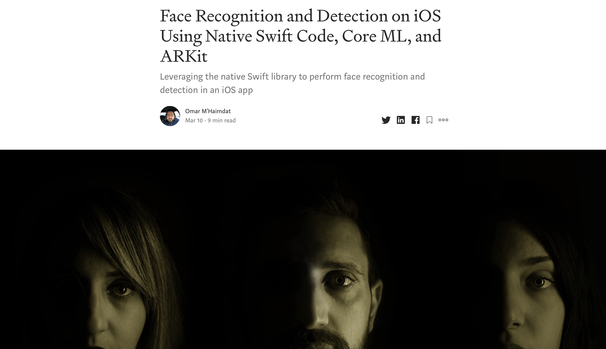

# Face Recognition and Detection on iOS Using Native Swift Code, Core ML, and ARKit
> Leveraging the native Swift library to perform face recognition and detection in an iOS app

## Article

**The tutorial is published on Heatbeat:**

## Face Mask

## Face Detection

## Face Classification

## Face Object Detection

## About me

Omar MHAIMDAT – [Linkedin](https://www.linkedin.com/in/omarmhaimdat/) – omarmhaimdat@gmail.com

Distributed under the MIT license. See ``LICENSE`` for more information.

[Look at the rest of my repos](https://github.com/omarmhaimdat/)
